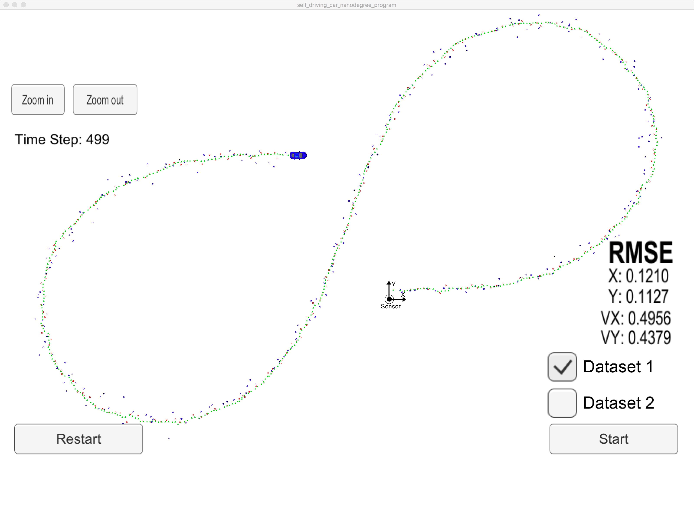

## Korda's Extended Kalman Filter Project for Udacity Self-Driving Car Nanodegree

[YouTube Video](https://youtu.be/)

---

The goals / steps of this project are the following:

* Implement an Extended Kalman Filter for tracking a pedestrian.
* Familiarize myself with C++ coding, classes, compiling, etc.

## [Rubric Points](https://review.udacity.com/#!/rubrics/748/view) 

Below are the images for fusion and non fusion:

### This is with fusion of Lidar and Radar:
![alt text][1]

  [1]: ./images/BestRMSE.jpeg 

### This is with Lidar only:
![alt text][2]

  [2]: ./images/LaserOnlyUpdates.jpeg 

### This is with Radar only:
![alt text][3]

  [3]: ./images/RadarOnlyUpdates.jpeg 
  
